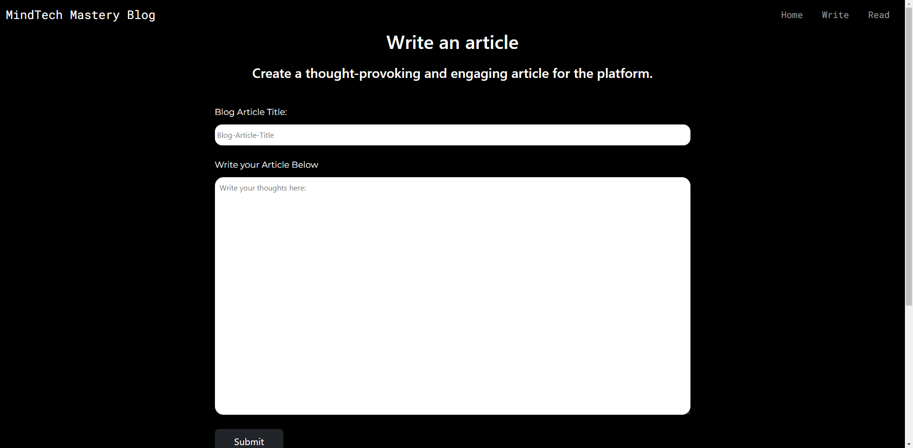

# Blog Webiste Capstone Project
------------------------------------------------
## Aim
------------------------------------------------
The purpose of the project was to consolidate concepts related to Web Developement Backend.
This project a wide array of tools, that can be used for Backend development. The concepts used were gettiong to NodeJS, and the Node Package Manager(NPM)
Understand the use of npm packages, and how to install them. Understanfing the role that middleware plays and how it can be applied, and also templating and partials.
This Capstone project is from the London App Brewery Web Development on Udemy
---------------------------------------------
## Tools
--------------------------------------------
The following tools topics were covered and applied in a hands-on approach
1. NodeJS: Explore, and understand the workings of NodaJS as an runtime environment, which gives us theability to run JS on our local machines.
2. Express: Express was used to initiate and use servers to handle requests, such as GET and POST.
3. Middleware: The body-parser and express-session middlewares were used to capture from input fields (body-parser), and express-session was used to use the captured data between routes.
4. EJS: Used to dynamically generate web-page content, using templateing. This project rreinforced, the topics learned in the course.
5. Github (version-Control): This project was also use a oppurtunity to polish up my github knowledge and use
----------------------------------------------
## Functionality
--------------------------------------------
The web app has three different pages.
1. *landing Page*: Thisi is the endpoint of the home route and has soe basic copy, in addition to, two buttons, that p[rompt the user to read an article or write one.
2. *Article Page*: This is a page where all the articles are located. The card on this page, will prompt a user to write an artivle, while th others are filled with Lorem Ipsum text.
3. *Create Page*: This page has 2 input areas for the user to create an article, the data from here is captured used body-parser, and the data is also stored in an express-session, to be used in another route.
   The submit button, will render the article page with the first card being populated with the user data.
4. *Reading Page*: This is a page where the user can read their work, this page can only be accesed, once an article has been written and their is a read button, available on the articles page to get a full view of the article
--------------------------------------------
## Front End Display of the Landing Page
--------------------------------------------------
  ### Landing Page
 )

 ------------------------------------------------------------------------------------------------------------------------
### Writing Page
------------------------------------------------------------

-----------------------------------------------------------------
### Reading Page
----------------------------------------------------------------------------------------------

